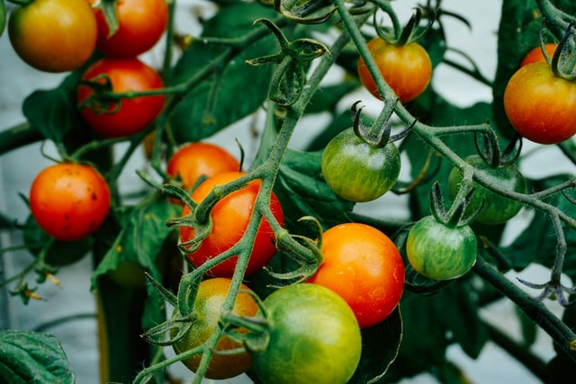

We run three gardening sessions each week, each lasting three hours, on Monday, Thursday and Saturday mornings. The Monday and Thursday sessions start at 9.30am while the Saturday session starts at 10.00am. Refreshments are provided including homemade soup and bread at the end of each session.
Participants are asked to pay a subscription of just £1 for each session.

During the summer months, HOPE organizes a range of activities for our users and volunteers to enjoy.  These include outings to the seaside, a trip on a canal barge, as well as an annual Open Day.  There is a small charge for our outings and trips to cover coach and barge hire.
